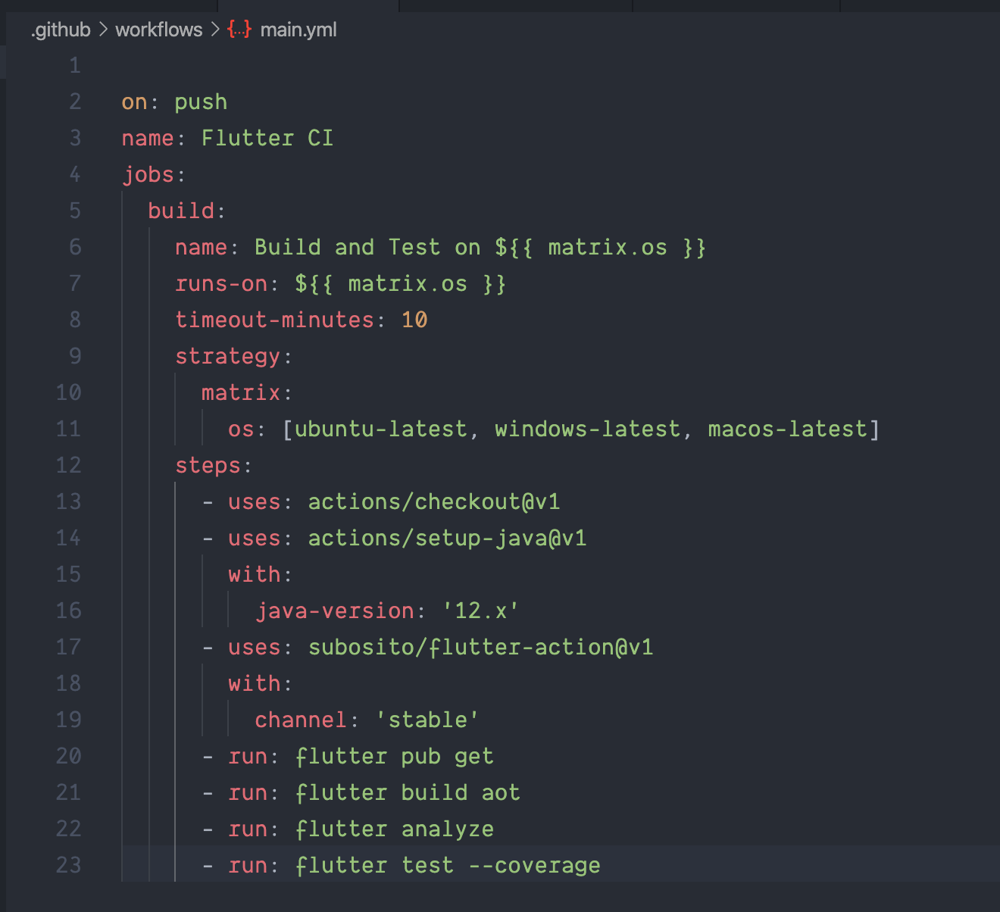
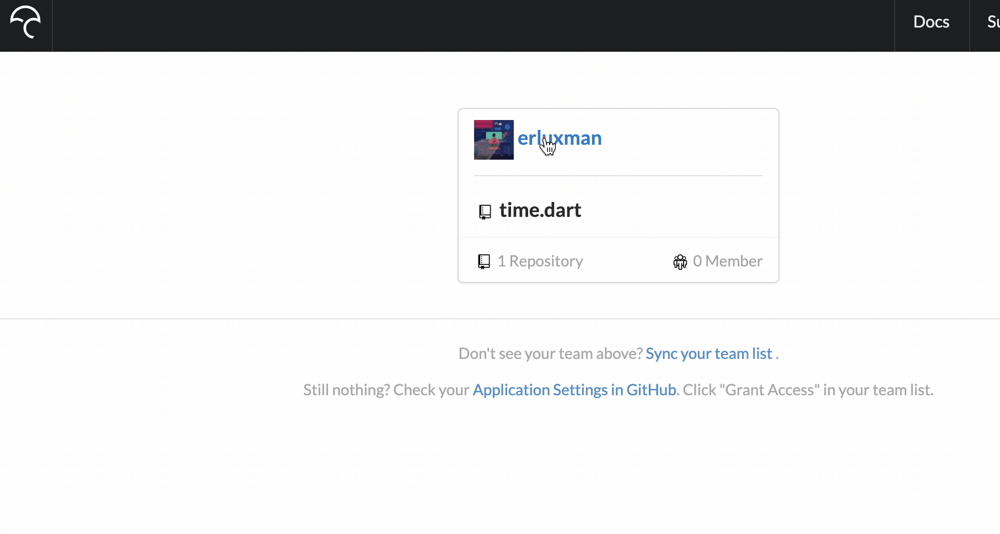
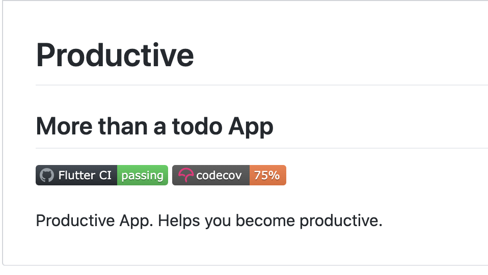
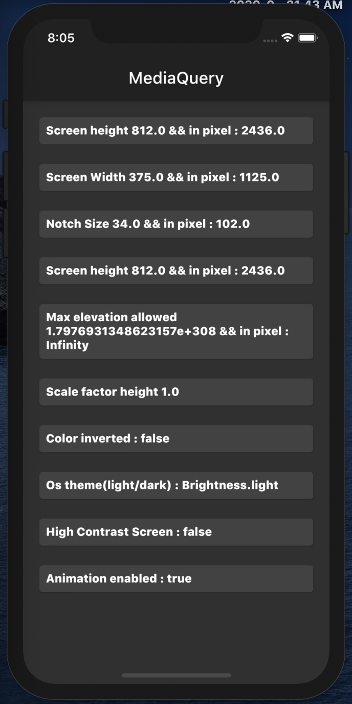
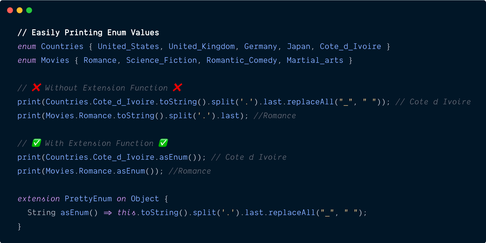
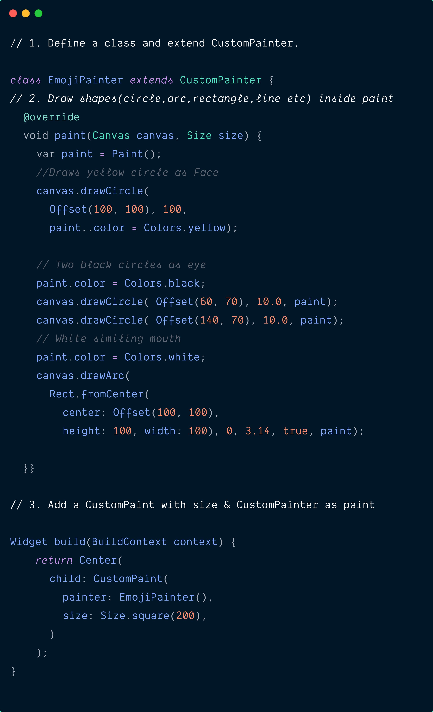
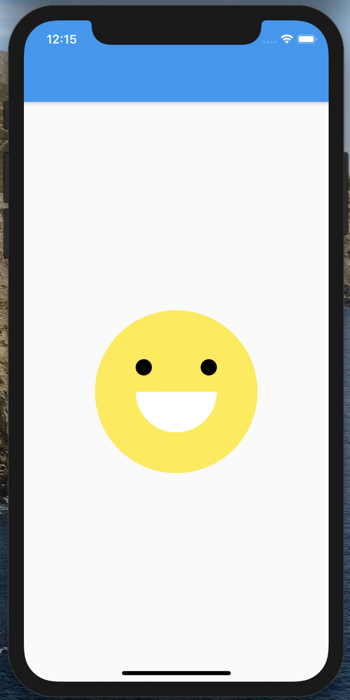
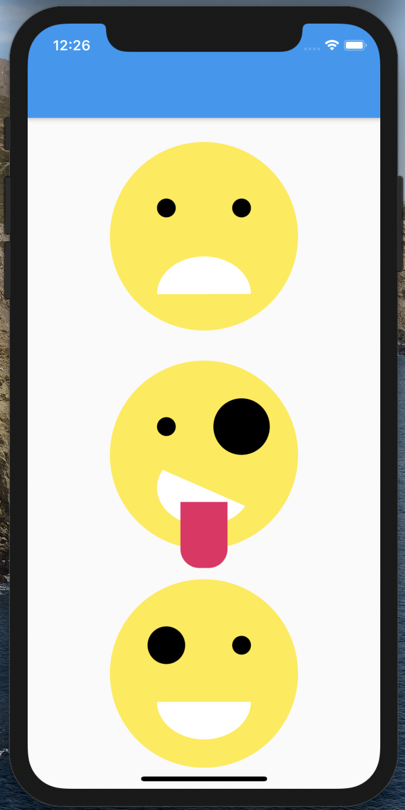
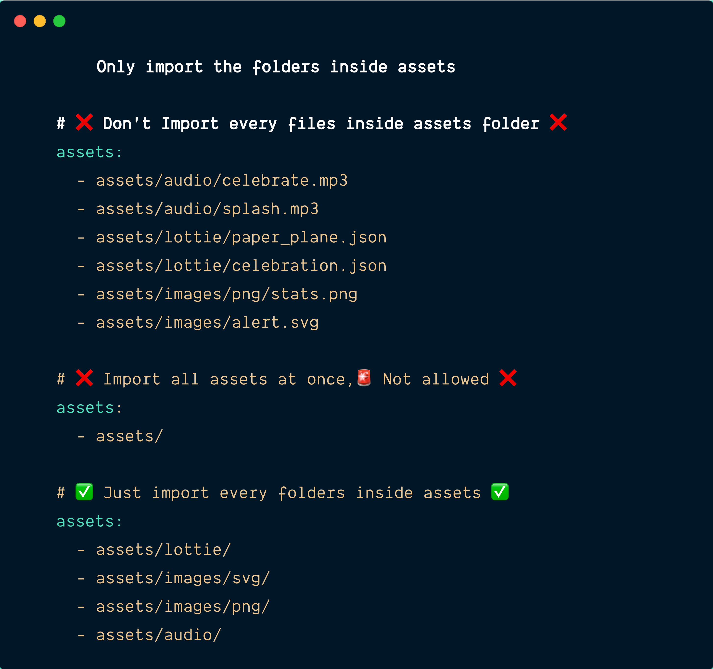

# Tips 61 - 80

## Tip 61 : Using Flare Animations

Similar to vector graphics, Flutter doesn't support vector animation natively. [Rive (rive.app)](https://rive.app/explore) helps with amazing vector animations in Flutter.

1. Add flare in `pubspec.yaml`:
```yaml
flare_flutter: ^version
```

2. Download flare files from [rive.app](https://rive.app/explore) & put those `.flr` files into 
```yaml
`assets/` folder:

        assets:
            - assets/
```
3. Start using `FlareActor` widget.
```dart
FlareActor(
        "assets/world.flr",

        //🚨Caution🚨, you can find 👉 #animation name in
        //left bottom 👈👇 of rive.app designer tool when
        //Animation tab is selected
            
        animation: "world")
```
[Visit Flare and SVG sample](https://github.com/erluxman/FlutterSVGFlareDemo)


## Tip 62 : `pubspec` autocomplete

When we want to add a dependency only way is either going to github document or pub.dev.

We can directly add dependencies from our IDEs using extensions/plugins.

__`For VS code`__ : [Pubspec Assist](https://marketplace.visualstudio.com/items?itemName=jeroen-meijer.pubspec-assist)            |  __`For Android Studio`__ : [Flutter Enhancement Suite](https://plugins.jetbrains.com/plugin/12693-flutter-enhancement-suite)
:-------------------------:|:-------------------------:
  |  

P.S. Flutter Enhancement Suite comes with a lot of other great features.

## Tip 63 : cached_network_image

`cached_network_image` helps to __`show`__ and __`cache`__ image from Internet.

It shows image from cache if it's already cached instead of downloading.

It will make app feel faster and save network bandwidth.

1. Add cached_network_image in pubspec.yaml

```yaml
dependencies:
cached_network_image: ^version
```
2. Start using `CachedNetworkImage`.
```dart
CachedNetworkImage(
        imageUrl: imageUrl,
        placeholder: (context, url) => CircularProgressIndicator(),
        errorWidget: (context, url, error) => Icon(Icons.error),
)
```

[get cached_network_image](https://pub.dev/packages/cached_network_image#-readme-tab-)

Image.network            |  CachedNetworkImage
:-------------------------:|:-------------------------:
  |  

## Tip 64 : `get_it`

`get_it` helps you to access :

- Service objects like `RESTClient`, `DB` & their `mocks` from anywhere.
- `(View/UI)Model,BLoCs` etc. from `Widgets`.

**without `BuildContext`.**

### To use `get_it`

1. Add get_it to dependencies

        dependencies:
        get_it: ^4.0.2

2. Provide an object/dependency to get_it

        void main() {
            GetIt.I.registerSingleton(Player.messi());
            runApp(MyApp());
        }

3. Get the dependency from anywhere in app with it's type.

        Player currentPlayer = GetIt.I<Player>();
        print(currentPlayer)  // Player{name: Messi,shirtNumber: 10}

[visit get_it](https://pub.dev/packages/get_it#-readme-tab-)

## Tip 65 : Setup Linter

Lint helps you to find potential errors, bugs, & code style inconsistancy etc.

__`To setup lint in Flutter :`__

1. Add lint in dev dependencies.

```yaml
dev_dependencies:
        lint: ^version
```
2. Add `analysis_options.yaml` in project root directory.


3. Include `package:lint/analysis_options.yaml` inside `analysis_options.yaml` and add your custom rules.

```yaml
include: package:lint/analysis_options.yaml

        # Custom Rules
        linter:
                rules:
                        sort_constructors_first: true
                        prefer_single_quotes: true
```
4. Done.

### Before Lint


### After Lint


[visit lint package](https://pub.dev/packages/lint)

## Tip 66 : assert(boolean,messageIfFalse)

If some `conditions` __`must not ever occur`__ on program, we use assert to halt the execution.

Assert condition means that there is no way we can handle exception caused if the condition fails, it must be fixed.

`assert()` statement also help reduce the responsibility of a program as it doesn't need to handle every edge cases.

`assert()` are ignored in release/production.

Some examples :

```dart
updateUser(User user){
        assert(user.id != null) // There is no way to udpate user without id.
        syncUser(user);
}

int  getRealSquareRoot(int square){
        assert(square >= 0) //square must be positive to have real root.
        return sqrt(square);
}

driveCar(Car car){
        assert(car.hasEngine);
        assert(car.hasFuel);
        assert(car.hasWheels);
        car.drive();
}
```
## Tip 67 : Show build Status badget on Readme


1. Create `.github/workflows/main.yml` Inside your project's root directory. or Run the command in your **terminal / Powershell** :
```bash
md .github/workflows  && cd "$_" && touch main.yml
```
2. Put the steps in [this](https://gist.github.com/erluxman/ac4916fedc3b37982181b0a631561d20) file inside `main.yml`


3. Add the build badge on your README.md.

        []({YOUR_GITHUB_PROJECT_URL}/actions)

4. Commit to Github.

## Tip 68 : Show code coverage badget on Readme 

1. Add the following steps at the end of your Github Actions  main.yml from previous tips.
Find the full `main.yml` file [here](https://github.com/erluxman/productive/blob/master/.github/workflows/main.yml)

       - uses: codecov/codecov-action@v1.0.2
           if: matrix.os == 'ubuntu-latest'
           with:
             token: ${{secrets.CODECOV}} #required
             file: ./coverage/lcov.info #optional 

2. Login/Sign up to [codecov.io](https://codecov.io/)
3. Go to [https://codecov.io/gh](https://codecov.io/gh) > click on your username > search the repo to show codecoverage and select it.


4. After that copy the Uplaod token (which should be staring at you at this point/inside setting tab)
5. Go to project's setting(__`not profile setting`__), select "Secrets" from left navigation panel, Add new secret


6. Add code Coverage badge to your github repo README file.

        [](https://codecov.io/gh/USER_NAME/REPO_NAME)

7. Git Push and wait for the build to complete, you will have the badges in your github Repo like this:


[See Video](https://www.youtube.com/watch?v=r4NQNSRWgY8)

## Tip 69 : `factory` constructors

Instead of using `static` methods to `create/return` `new/cached` instance of it's class or it's sub classi.e. __`factory pattern`__, we can use `factory constructors`.

`factory` constructors **behave** like `static methods` but **called** like `normal constructors`. Factory constructors can also be be named & unnamed.

    void main() {
          //❌ static method ❌ 
          var staticUser = User.getUser("John Doe");

          //✅ factory connstructor ✅
          var factoryUser = User("John Doe");
    }
    class User {
          User._(this.name);
          String name;
          
          static Map<String, User> users = {};

          //❌ static method ❌ 
          static User getUser(String name) => users.putIfAbsent(name, () => User._(name));
          
          //✅ factory connstructor ✅
          factory User(String name) =>  users.putIfAbsent(name, () => User._(name));
    }

## Tip 70 : `AnimatedDefaultTextStyle`

We can animate change in TextStyle with `AnimatedDefaultTextStyle`.

Just give the animation `duration` & the updated `TextStyle`. `AnimatedDefaultTextStyle` will take care of the rest.

        AnimatedDefaultTextStyle(
          duration: Duration(milliseconds: 300),
          child: Text("Flutter"),
          style: newStyle,
        )

[try in codepen](https://codepen.io/erluxman/pen/XWXKBJP)


## Tip 71 : MediaQuery

`MediaQuery` gives the information about screen like `height`, `width`, `pixels`, `notch size`, **Device scale factor & text scale factor set on setting**, `device theme light/dark` , system animation `enabled/disabled` etc.
[try on codepen](https://codepen.io/erluxman/pen/xxZEZGG)



## Tip 72 : Decimal points

Want to get desired number of digits after decimal?

1. Use `number.toStringAsFixed()`  
2. Parse the String to number.

For convenience we can use extension functions.
[try on dartpad](https://dartpad.dartlang.org/3bdfd6923d1e8788ed81eaae9e77655f)


## Tip 73 : String multiplication

You can multiply String like numbers.

    "Foo"*2 //Foo
    "Bar "*5 //Bar Bar Bar Bar Bar


## Tip 74 : enum values

Getting value of `enum` is **not trivial** in dart. This simple extension function can get rid of `Pain in the enum.`

1. Define this extension
2. Start calling `.asEnum()` in any `enum` to print the `Value`.
3. You can use underscore `_` if you want space between words.

[try in dartpad](https://dartpad.dartlang.org/f8233e822afa073a90018c3bf8a9e271)



## Tip 75 : Don't be afraid with `mixin`, it's here to help

### 💣 Spoiler : `mixin` is not related to Animation by any means 😂, its just another keyword like `class`

### But mixin is similar to

#### **fastfood 🍔/ plugin 🧩/ an interface with already implemented methods & state, that is ready to be used without reimplementing those features everywhere we need them**

When paired up with a `StatefulWidget`'s `State`,`TickerProviderStateMixin` creates `ticker` that ticks with every frame which is need by every AnimationController . It also disposes ticker when stateful widget disposes. That's why we provide `this` as TickerProvider(`vsync`) in every AnimationController.

Similarly we use ListMixin to use obvious implementation of List so that we do not have to implement obvious stuffs in every List implementation like `ElementList,NodeList,FileList,TouchList` etc.

`extends (inheritance)` => only one class can be inherited along with their public/protected members and behaviors.

`implements (contract)` => many classes can be implemented but we have to redefine every behavior.

`with(mixin)` => Many classes can be mixed in and we can reuse the behavior of them.

Any class or abstract class can be used as mixin. But we declare mixin, it cannot be extended like normal class or abstract class.

    class A{} //Declaring class
    mixin B{} //Declaring mixin
    class C extends A{} // Valid ✅
    class C extends B{} // Invalid ❌

A mixin cannot use another mixin.

    mixin C with B{} // Invalid ❌

#### Conclusion : Use `mixin` if you want to reuse the behavior and state of multiple classes

## Tip 76 : CustomPainter

CustomPainter provides canvas to draw different shapes.

1. Define a class and extend CustomPainter.
2. Override paint(canvas,size) method and draw various shapes(circle,arc,rectangle,line etc) inside it.
3. Add a CustomPaint widget  on screen and pass the CustomPainter as paint and it's size.



Output




[try on codepen](https://codepen.io/erluxman/pen/YzwZpba)

## Tip 77 : Pause / wait program flow

Do you want pause program flow for a certain duration? You can use `Future.delayed()` :

`await Future.delayed( duration )`


## Tip  78 : Easy navigation

Have you been navigating to different screen like this?

 ❌ Dont do this anymore ❌

    Navigator.of(this).push(
          MaterialPageRoute(builder: (context) => NextScreen()),
        );

 ✅ Do this ✅

1. Define a simple extension on `BuildContext`.

        extension NavigationExtension on BuildContext {
          
          navigateTo(Widget destination) {
            Navigator.of(this).push(
              MaterialPageRoute(builder: (context) => destination),
            );
          }
        }
2. 🎉 Celebrate 🎉 🎉

        context.navigateTo( NextScreen());
        context.navigateTo( SeventhScreen());
        context.navigateTo( SettingPage());

## Tip  79 : Just import every folders inside assets rather than every files

**It's too much of work 😰🥱 to import every assets like image 🏞, json , audio 🎵into `pubspec.yml`**

**But sadly 😢, you can't import just the `assets` folder.**

**Just import all the folders, it will work 🎉🍾.**



## Tip  80 : Awesome way to access resources like images, fonts, strings and links

Instead of using raw string, path & URLs, we can organize them in Resource classes.

 __`Group constants, paths and strings by their types`__

    class Strings {
      String appName = "Productive";
      String privacyURL = "https://blabla.com";
    }
    class SVGImages { String homeIcon = "assets/images/home.svg";}
    class LottieFiles { String paperPlane = "assets/lottie/paper_plane.json";}    

__`Organize all resource into one class`__

    class R {
      static Strings strings = Strings();
      static SVGImages svgImages = SVGImages();
      static LottieFiles lottieFiles = LottieFiles();
    }

__`Use resources instead of raw strings and path`__

    // ❌ Don't use raw Strings & Paths ❌
    Text("Productive"),
    Image.asset("assets/images/home.svg"),
    Lottie.asset("assets/lottie/paper_plane.json"),   

    // ✅ Acess String & Pathsfrom Resource ✅
    Text(R.strings.appName),
    Image.asset(R.svgImages.homeIcon),
    Lottie.asset(R.lottieFiles.paperPlane),

[__`Tips 1-20`__](README.md)
[__`Tips 21-40`__](page2.md)

[__`<< Previous`__](page3.md)
[___`Tips 61-80`___](page4.md)
[__`Next >>`__](page5.md)
